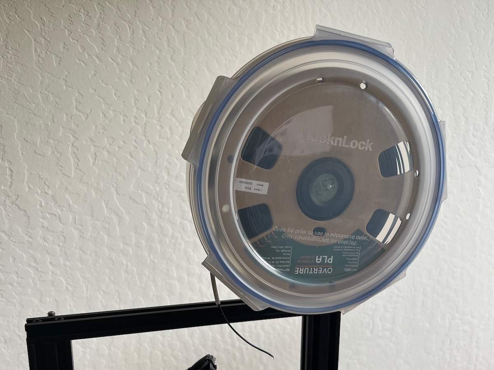
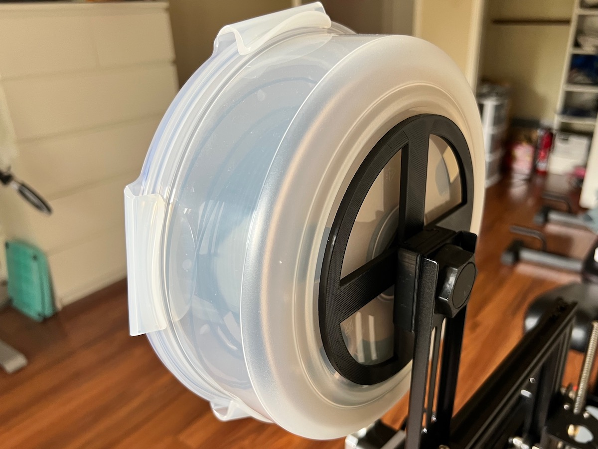
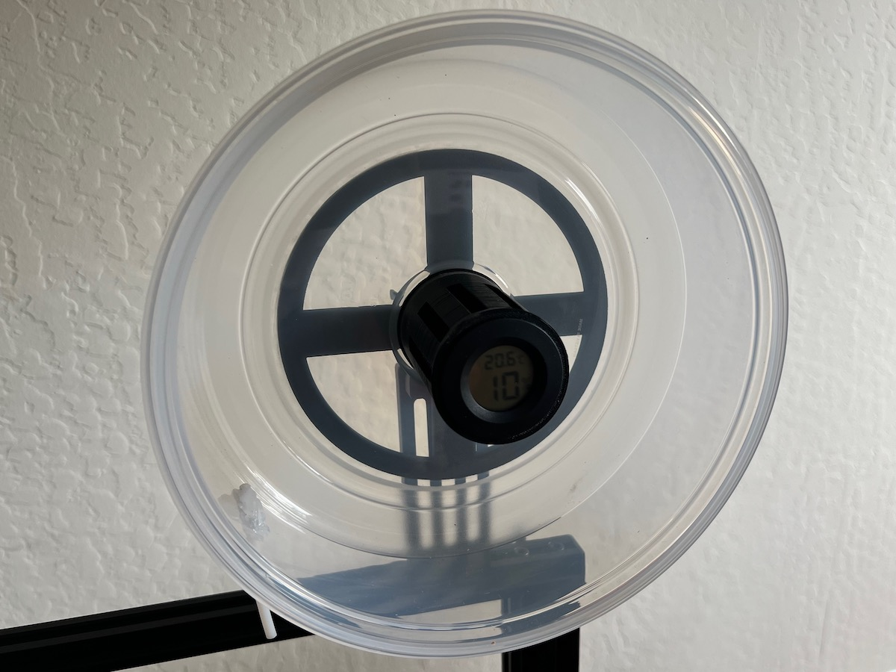

# Spool holder

Fully parametric code that generates parts to turn any airtight food container into a filament holder to use while
printing. It has a central spindle that rotates and houses desiccant and a temperature/humidity sensor.

THe holder is meant to be mounted to any of the [Filler mounts](https://www.thingiverse.com/thing:3020026/files).

# Photos

## Model

The [`spool-holder.py`](spool-holder.py) file has the parametric model using CadQuery. You can change the size, the
number of bearings and a all other parameters to fit your box.

## Output

There are 3 parts that are generated and need to be 3D-printed:

- [`base`](base.stl): Stationary base that sits outside the box and allows it to be mounted. E.g. for an Ender 3 using
  the stock metal holder plate, you can print the [Filler](https://www.thingiverse.com/thing:3020026/files) bolt
  (`FillerBraceCrealityBolt.stl`) and nut (`FillerBraceCrealityNut.stl`).
- [`spacer`](spacer.stl): Stationary spacer that sits inside the box, houses the nut and sits against the inner part of
  the bearing.
- [`spindle`](spindle.stl): The rotating spindle, connected to the outer part of the bearing. You can put desiccant
  inside and add a cheap temperature/humidity sensor.

## Parts needed

In the default config you need:

- 1 Airtight food container, e.g. Lock & Lock 2.5 liters: https://www.amazon.com/dp/B00BUKKBTO
- 2 608ZZ ball bearings (8mm x 22mm x 7mm), e.g. https://www.amazon.com/dp/B092LGTD9P
- 1 M5 bolt of about 40mm length (excluding the head). If you are customizing the code, it will print the length of the
  bolt you need
- 1 or 2 M5 nuts
- Some Bowden tubing to guide the filament in the box
- Hot glue to glue the Bowden tube
- (Optional) A flat piece of rubber to use for better isolation of the base
- (Optional) Desiccant for keeping humidity down
- (Optional) Circular temperature/humidity sensor, e.g. https://www.amazon.com/dp/B07GR67G1M

## Build steps

1. Drill a 5mm hole in the center of the box
1. Assemble everything in the order (from outside-in): M5 bolt > base > rubber isolation > container wall > spacer >
   bearings > spindle > M5 nut(s)
1. (Optional) Add desiccant in the spindle hole
1. (Optional) Add temperature/humidity sensor
1. Drill a 4mm hole on the side of the box at a steep angle (see picture)
1. Run Bowden tubing through the hole and use hot glue to secure it
